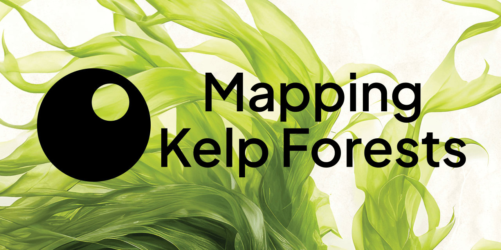

[](https://teamepoch.ai/competitions/mappingkelpforests/)

[](https://teamepoch.ai/)
[![DrivenData Badge](https://img.shields.io/badge/-Kelp_Wanted:_Segmenting_Kelp_Forests-173248?logo=data:image/svg+xml;base64,PD94bWwgdmVyc2lvbj0iMS4wIiBlbmNvZGluZz0iVVRGLTgiIHN0YW5kYWxvbmU9Im5vIj8+CjxzdmcKICAgaWQ9IkxheWVyXzEiCiAgIGRhdGEtbmFtZT0iTGF5ZXIgMSIKICAgdmlld0JveD0iMCAwIDM2IDM2IgogICB2ZXJzaW9uPSIxLjEiCiAgIHhtbDpzcGFjZT0icHJlc2VydmUiCiAgIHdpZHRoPSIzNiIKICAgaGVpZ2h0PSIzNiIKICAgeG1sbnM9Imh0dHA6Ly93d3cudzMub3JnLzIwMDAvc3ZnIgogICB4bWxuczpzdmc9Imh0dHA6Ly93d3cudzMub3JnLzIwMDAvc3ZnIgogICB4bWxuczpyZGY9Imh0dHA6Ly93d3cudzMub3JnLzE5OTkvMDIvMjItcmRmLXN5bnRheC1ucyMiCiAgIHhtbG5zOmNjPSJodHRwOi8vY3JlYXRpdmVjb21tb25zLm9yZy9ucyMiCiAgIHhtbG5zOmRjPSJodHRwOi8vcHVybC5vcmcvZGMvZWxlbWVudHMvMS4xLyI+PGRlZnMKICAgICBpZD0iZGVmczE0IiAvPjx0aXRsZQogICAgIGlkPSJ0aXRsZTEiPmRyaXZlbmRhdGEtbG9nbzwvdGl0bGU+PG1ldGFkYXRhCiAgICAgaWQ9Im1ldGFkYXRhMTQiPjxyZGY6UkRGPjxjYzpXb3JrCiAgICAgICAgIHJkZjphYm91dD0iIj48ZGM6dGl0bGU+ZHJpdmVuZGF0YS1sb2dvPC9kYzp0aXRsZT48L2NjOldvcms+PC9yZGY6UkRGPjwvbWV0YWRhdGE+PHJlY3QKICAgICBzdHlsZT0iZm9udC12YXJpYXRpb24tc2V0dGluZ3M6J3dnaHQnIDYwMDtkaXNwbGF5OmlubGluZTtmaWxsOiNmZmRlMzU7ZmlsbC1vcGFjaXR5OjE7c3Ryb2tlOm5vbmU7c3Ryb2tlLXdpZHRoOjEuMDU4MjI7c3Ryb2tlLW9wYWNpdHk6MCIKICAgICBpZD0ieWVsbG93IgogICAgIHdpZHRoPSIzNiIKICAgICBoZWlnaHQ9IjQuNSIKICAgICB4PSIwIgogICAgIHk9IjAiIC8+PHJlY3QKICAgICBzdHlsZT0iZm9udC12YXJpYXRpb24tc2V0dGluZ3M6J3dnaHQnIDYwMDtkaXNwbGF5OmlubGluZTtmaWxsOiNhZmRkNWU7ZmlsbC1vcGFjaXR5OjE7c3Ryb2tlOm5vbmU7c3Ryb2tlLXdpZHRoOjAuOTUzODY2O3N0cm9rZS1vcGFjaXR5OjAiCiAgICAgaWQ9ImdyZWVuIgogICAgIHdpZHRoPSIyOS4yNSIKICAgICBoZWlnaHQ9IjQuNSIKICAgICB4PSIwIgogICAgIHk9IjQuNSIgLz48cmVjdAogICAgIHN0eWxlPSJmb250LXZhcmlhdGlvbi1zZXR0aW5nczond2dodCcgNjAwO2Rpc3BsYXk6aW5saW5lO2ZpbGw6I2VhOTVjYTtmaWxsLW9wYWNpdHk6MTtzdHJva2U6bm9uZTtzdHJva2Utd2lkdGg6MS4wMjQ2O3N0cm9rZS1vcGFjaXR5OjAiCiAgICAgaWQ9InBpbmsiCiAgICAgd2lkdGg9IjMzLjc1IgogICAgIGhlaWdodD0iNC41IgogICAgIHg9IjAiCiAgICAgeT0iMTMuNSIgLz48cmVjdAogICAgIHN0eWxlPSJmb250LXZhcmlhdGlvbi1zZXR0aW5nczond2dodCcgNjAwO2Rpc3BsYXk6aW5saW5lO2ZpbGw6Izk4YWFkMTtmaWxsLW9wYWNpdHk6MTtzdHJva2U6bm9uZTtzdHJva2Utd2lkdGg6MC43OTM2MzY7c3Ryb2tlLW9wYWNpdHk6MCIKICAgICBpZD0iYmx1ZSIKICAgICB3aWR0aD0iMjAuMjUiCiAgICAgaGVpZ2h0PSI0LjUiCiAgICAgeD0iMCIKICAgICB5PSIxOCIgLz48cmVjdAogICAgIHN0eWxlPSJmb250LXZhcmlhdGlvbi1zZXR0aW5nczond2dodCcgNjAwO2Rpc3BsYXk6aW5saW5lO2ZpbGw6I2ZjOTg2ZDtmaWxsLW9wYWNpdHk6MTtzdHJva2U6bm9uZTtzdHJva2Utd2lkdGg6MC45ODk4NTtzdHJva2Utb3BhY2l0eTowIgogICAgIGlkPSJvcmFuZ2UiCiAgICAgd2lkdGg9IjMxLjUiCiAgICAgaGVpZ2h0PSI0LjUiCiAgICAgeD0iMCIKICAgICB5PSIyNyIgLz48cmVjdAogICAgIHN0eWxlPSJmb250LXZhcmlhdGlvbi1zZXR0aW5nczond2dodCcgNjAwO2Rpc3BsYXk6aW5saW5lO2ZpbGw6IzcxYzlhZTtmaWxsLW9wYWNpdHk6MTtzdHJva2U6bm9uZTtzdHJva2Utd2lkdGg6MS4wNTgyMjtzdHJva2Utb3BhY2l0eTowIgogICAgIGlkPSJ0ZWFsIgogICAgIHdpZHRoPSIzNiIKICAgICBoZWlnaHQ9IjQuNSIKICAgICB4PSIwIgogICAgIHk9IjMxLjUiIC8+PC9zdmc+Cg==)](https://www.drivendata.org/competitions/255/kelp-forest-segmentation/)
[![Python Version](https://img.shields.io/badge/Python-3.10-4584b6.svg?logo=data:image/svg+xml;base64,PHN2ZyB4bWxucz0iaHR0cDovL3d3dy53My5vcmcvMjAwMC9zdmciIHdpZHRoPSI2NCIgaGVpZ2h0PSI2NCIgdmlld0JveD0iMCAwIDMyIDMyIj48ZGVmcz48bGluZWFyR3JhZGllbnQgaWQ9IkEiIHgxPSI4MTEuNTI3IiB5MT0iNTc0Ljg5NSIgeDI9IjY2NS4yNTUiIHkyPSI1NzMuNzMyIiBncmFkaWVudFVuaXRzPSJ1c2VyU3BhY2VPblVzZSI+PHN0b3Agb2Zmc2V0PSIwIiBzdG9wLWNvbG9yPSIjMzY2YTk2Ii8+PHN0b3Agb2Zmc2V0PSIxIiBzdG9wLWNvbG9yPSIjMzY3OWIwIi8+PC9saW5lYXJHcmFkaWVudD48bGluZWFyR3JhZGllbnQgaWQ9IkIiIHgxPSI4NjIuODI0IiB5MT0iNjQyLjE3NiIgeDI9IjU3My4yNzYiIHkyPSI2NDIuMTc2IiBncmFkaWVudFVuaXRzPSJ1c2VyU3BhY2VPblVzZSI+PHN0b3Agb2Zmc2V0PSIwIiBzdG9wLWNvbG9yPSIjZmZjODM2Ii8+PHN0b3Agb2Zmc2V0PSIxIiBzdG9wLWNvbG9yPSIjZmZlODczIi8+PC9saW5lYXJHcmFkaWVudD48L2RlZnM+PGcgdHJhbnNmb3JtPSJtYXRyaXgoLjE2MTcgMCAwIC4xNTgwODkgLTEwNy41Mzc2NCAtODEuNjYxODcpIj48cGF0aCBkPSJNNzE2LjI1NSA1NDQuNDg3YzAtMTMuNjIzIDMuNjUzLTIxLjAzNCAyMy44MjItMjQuNTYzIDEzLjY5My0yLjQgMzEuMjUtMi43IDQ3LjYyNyAwIDEyLjkzNSAyLjEzNSAyMy44MjIgMTEuNzcgMjMuODIyIDI0LjU2M3Y0NC45NDVjMCAxMy4xODItMTAuNTcgMjMuOTgtMjMuODIyIDIzLjk4aC00Ny42MjdjLTE2LjE2NCAwLTI5Ljc4NyAxMy43ODItMjkuNzg3IDI5LjM2M3YyMS41NjRoLTE2LjM3NmMtMTMuODUyIDAtMjEuOTE3LTkuOTg4LTI1LjMwNS0yMy45NjQtNC41Ny0xOC43NzYtNC4zNzYtMjkuOTYzIDAtNDcuOTQ1IDMuNzk0LTE1LjY4NyAxNS45MTctMjMuOTY0IDI5Ljc3LTIzLjk2NGg2NS41MnYtNmgtNDcuNjQ1di0xNy45OHoiIGZpbGw9InVybCgjQSkiLz48cGF0aCBkPSJNODExLjUyNyA2ODguMzJjMCAxMy42MjMtMTEuODIzIDIwLjUyMy0yMy44MjIgMjMuOTY0LTE4LjA1MiA1LjE4OC0zMi41NCA0LjM5NC00Ny42MjcgMC0xMi42LTMuNjctMjMuODIyLTExLjE3LTIzLjgyMi0yMy45NjR2LTQ0Ljk0NWMwLTEyLjkzNSAxMC43ODItMjMuOTggMjMuODIyLTIzLjk4aDQ3LjYyN2MxNS44NjQgMCAyOS43ODctMTMuNzEgMjkuNzg3LTI5Ljk2M3YtMjAuOTY0aDE3Ljg1OGMxMy44NyAwIDIwLjQgMTAuMzA1IDIzLjgyMiAyMy45NjQgNC43NjQgMTguOTcgNC45NzYgMzMuMTU3IDAgNDcuOTQ1LTQuODE3IDE0LjM2NC05Ljk3IDIzLjk2NC0yMy44MjIgMjMuOTY0SDc2My45djZoNDcuNjI3djE3Ljk4eiIgZmlsbD0idXJsKCNCKSIvPjxwYXRoIGQ9Ik03MjguMTY2IDU0MS41MDVjMC00Ljk3NiAzLjk4OC05IDguOTMtOSA0LjkyMyAwIDguOTMgNC4wMjMgOC45MyA5IDAgNC45Ni00LjAwNiA4Ljk4Mi04LjkzIDguOTgyLTQuOTQgMC04LjkzLTQuMDIzLTguOTMtOC45ODJ6bTUzLjU5IDE0OS43OThjMC00Ljk2IDQuMDA2LTguOTgyIDguOTMtOC45ODIgNC45NCAwIDguOTMgNC4wMjMgOC45MyA4Ljk4MiAwIDQuOTc2LTMuOTg4IDktOC45MyA5LTQuOTIzIDAtOC45My00LjAyMy04LjkzLTl6IiBmaWxsPSIjZmZmIi8+PC9nPjwvc3ZnPg==)](https://www.python.org/downloads/)
[](https://github.com/astral-sh/ruff)
[](https://mypy-lang.org/)

# Kelp Wanted: Segmenting Kelp Forests - 1st place solution 🏆

This is Team Epoch's 1st place solution to
the [Kelp Wanted: Segmenting Kelp Forests](https://www.drivendata.org/competitions/255/kelp-forest-segmentation/)
competition.

A [technical report](Detect_Kelp___Technical_Report.pdf) is included in this repository.

## Getting started

This section contains the steps that need to be taken to get started with our project and fully reproduce our best
submission on the private leaderboard. The project was developed on Windows 10/11 OS on Python 3.10.13 on Pip version 23.2.1.

### 0. Prerequisites
Models were trained on machines with the following specifications:
- CPU: AMD Ryzen Threadripper Pro 3945WX 12-Core Processor / AMD Ryzen 9 7950X 16-Core Processor
- GPU: NVIDIA RTX A5000 / NVIDIA RTX Quadro 6000 / NVIDIA RTX A6000
- RAM: 96GB / 128GB
- OS: Windows 10/11
- Python: 3.10.13
- Estimated training time: 3-6 hours per model on these machines.

For running inference, a machine with at least 32GB of RAM is recommended. We have not tried running the inference on a
machine with less RAM using all the test data that was provided by DrivenData.

### 1. Clone the repository

Make sure to clone the repository with your favourite git client or using the following command:

```
https://github.com/TeamEpochGithub/iv-q2-detect-kelp.git
```

### 2. Install Python 3.10.13

You can install the required python version here: [Python 3.10.13](https://github.com/adang1345/PythonWindows/blob/master/3.10.13/python-3.10.13-amd64-full.exe)

### 3. Install the required packages

Install the required packages (on a virtual environment is recommended) using the following command:
A .venv would take around 7GB of disk space.

```shell
pip install -r requirements.txt
```

### 4. Setup the competition data

The data of the competition can be downloaded here: [Kelp Wanted: Segmenting Kelp Forests](https://www.drivendata.org/competitions/255/kelp-forest-segmentation/data/)
Unzip all the files into the `data/raw` directory.
The structure should look like this:

```
data/
    ├── processed/ # Cache directory for processed data. 
    ├── raw/ # @TODO Competition data must be PLACED HERE
        ├── submission_format/ # @TODO Submission format from the competition
        ├── test_satellite/ # @TODO Test satellite images from the competition
        ├── train_kelp/ # @TODO Train kelp images from the competition
        ├── train_satellite/ # @TODO Train satellite images from the competition
        ├── metadata_fTq0l2T.csv # @TODO Metadata from the competition
    ├── test/ # Test caching
    ├── training/ # Training cache
```

### 5. Main files explanation

- `train.py`: This file is used to train a model. `train.py` reads a configuration file from `conf/train.yaml`. This configuration file 
contains the model configuration to train with additional training parameters such as test_size and a scorer to use. 
The model selected in the `conf/train.yaml` can be found in the `conf/model` folder where a whole model configuration is stored (from preprocessing to postprocessing).
When training is finished, the model is saved in the `tm` directory with a hash that depends on the specific pre-processing, pretraining steps + the model configurations.

    - Command line arguments
    - CUDA_VISIBLE_DEVICES: The GPU to use for training. If not specified it uses DataParallel to train on multiple GPUs.  If you have multiple GPUs, you can specify which one to use.
- `submit.py`: This file does inference on the test data from the competition given trained model or an ensemble of trained models. 
It reads a configuration file from `conf/submit.yaml` which contains the model/ensemble configuration to use for inference.
Model configs can be found in the `conf/model` folder and ensemble configs in the `conf/ensemble` folder. The `conf/ensemble`
folder specifies the models (`conf/model`) to use for the ensemble and the weights to use for each model. The `submit.py` 

### 6. Place the fitted models
(For DrivenData) Any additional supplied trained models /scalers (.pt / .gbdt / .scaler) should be placed in the `tm` directory. 
When these models were trained, they are saved with a hash that depends on the specific pre-processing, pretraining steps + the model configurations.
In this way, we ensure that we load the correct saved model automatically when running `submit.py`.

### 7. Run submit.py

For reproducing our best submission, run `submit.py`. This will load the already configured `submit.yaml` file and
run the inference on the test data from the competition. `submit.yaml` in configured to what whe think is our best and our
most robust solution:

`conf/ensemble/21-02-1st.yaml` contains a mixed ensemble of models trained on different feature sets, including UNets with VGG encoders, SwinTransformers and a ConvNext model.


If you get an error of that the path was not found of a model. Please ensure that you have the correct trained model in the `tm` directory.
If you don't have the trained models, you can train them 1 by 1 using `train.py` and the `conf/train.yaml` file.

`submit.py` will output a `submission.zip` in the root of the project directory. This file can be uploaded to the competition page. 


## Quality Checks

Quality checks are performed using [pre-commit](https://pre-commit.com/) hooks. To install these hooks, run:

```shell
pre-commit install
```

To run the pre-commit hooks locally, do:

```shell
pre-commit run --all-files
```

## GBDT

Due to long training times, we reused trained models for the GBDT. To train these, set `test_size` to zero, and remove
the `saved_at` from a model config.
Once it is saved, it is possible to set `saved-at` to the filename of the saved model, and use this for any runs
regardless of test size.


## Documentation

Documentation is generated using [Sphinx](https://www.sphinx-doc.org/en/master/).

To make the documentation, run `make html` with `docs` as the working directory. The documentation can then be found in `docs/_build/html/index.html`.

Here's a short command to make the documentation and open it in the browser:

```shell
cd ./docs/;
./make.bat html; start chrome file://$PWD/_build/html/index.html
cd ../
```

## Contributors

This repository was created by [Team Epoch IV](https://teamepoch.ai/team#iv), based in the [Dream Hall](https://www.tudelft.nl/ddream) of the [Delft University of Technology](https://www.tudelft.nl/).

Read more about this competition [here](https://teamepoch.ai/competitions/mappingkelpforests/).

[](https://github.com/EWitting)
[](https://github.com/Jeffrey-Lim)
[](https://github.com/hjdeheer)
[](https://github.com/schobbejak)
[](https://github.com/tolgakopar)
